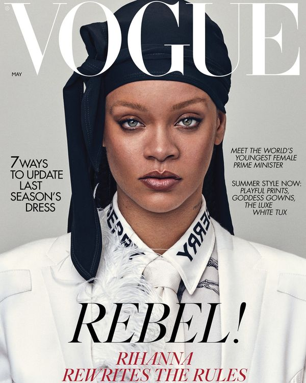

As a woman who reads magazines religiously, I just knew that my first blog post had to be about the global favourite, Vogue. The uniquely stylistic magazine is recognised all over the world. This is heavily due to the cutting-edge typography design choices that complement the magazine design and communicate the nature and personality of the magazine.

The infamous Vogue lettering has always illustrated an air of sophistication, elegance and luxury. This is a clear parallel to the brands and products they advertise and feature within their magazines. Although Vogue has no official logo, it uses its masthead as a starring role which successfully suffices as their global brand recognition. The high quality didone serif font is ultra-chic and takes a modern approach, despite being designed in 1945. The font was designed by Vladimir Nikolic.

Prior to this, type choices in Vogue differed between serif and sans serif but also interchanged regularly and took inspiration from the illustrations and print that were on the front cover of that issue. Vogue's font and masthead is so widely recognised that some of the lettering can be partially hidden by the images featured without masking the identity of the brand.

The simplicity of the bold letters is extremely appealing and iconic. In conjunction with this, the masthead lettering and surrounding areas is widely spread out and sparse. This again shows the high-end quality of the magazine as they have lots of space and money to work with which is conveyed within the typography. The variable that the typography portrays is most definitely luxury over squalor as it is evenly spread and possesses lots of space and authority. Typically, there isn’t much typography on the covers of vogue. It often makes use of all the space they possess. This is a clear contrast to other magazines as they typically cram lots of text onto the front cover.

Another interesting component of Vogue’s typography is the variating colour of the masthead. The colours featured are often black, pink, white and red. This varies depending on the magazine cover art and photography. This presents an elite typographical voice as the everchanging colour of the fonts (both the masthead and the surrounding text) all contributes to make the cover eye-catching and appealing for their immense audience.

Vogue depicts three major types of fonts within their front covers and general texts. The elite, recognisable masthead Didot font, a bold coloured sans serif and a more neutral serif for subheadings.

The classic Didot typeface is typically characterised by increased stroke contrast, hairline strokes, vertical stress, and flat, unbracketed serifs. High quality paper and printing equipment are necessary in order to print this typeface. This once again illustrates the prestige imprint Vogue holds.