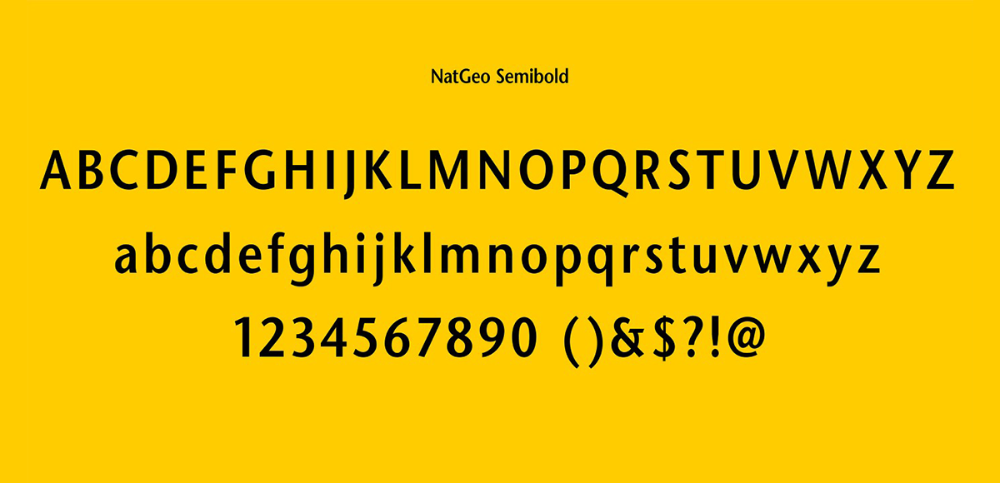

One of my all-time favourite magazines has to be National Geographic. It is enriched in culture and knowledge that is unrivalled by any other publication. The magazine primarily focuses on geography, history, science, global culture and exploration while featuring ground-breaking, and often award winning, photographs.

The National Geographic Magazine is a global publication appearing in over 170 countries reaching millions of people to inform, challenge and inspire. The publication has published continuously like clockwork ever since its first issue in 1888, showcasing their obvious success. So, how much has typography, and its design, contributed to this continual success?

This global, unique magazine is recognised with ease all over the world. This is because of the deliberate, careful choosing of typography that is featured throughout the magazine.

On the magazine front cover and in the story text a custom font is used called NatGeo Semi Bold. This is a serif font that features small lines attached to the letters’ strokes. This font exhibits a cleanliness and minimalistic look that is also continued throughout the magazine’s pages that follow. It appears very polished and offers a geometric, empathetic typeface. It also presents itself very clearly and with authority. This conveys and coincides with the content of the magazine, as it presents educational facts and figures which the font of the logo helps to introduce and maintain that voice. The logo 'National Geographic' doesn't offer much spacing between the lettering so is a condensed font.

An interesting, repetitive component of the typography is the cover text and yellow box that surrounds it. This brand identity is an iconic, recognisable feature on the front page that can be recognised globally due to the unique and cutting-edge font it possesses. This creates a strong brand image.

Throughout an issue, the editors use various fonts for different components of the magazine. For example, [the captions](http://587.claudiastrong.com/national-geographic-typography/) under photographs and images have their own specific typography. They use a sans serif without lines which is sometimes bolded. This differs to the main body text font and other fonts that are used throughout. This is effective as it captures the attention of the reader because it creates a break in the reading style they were used to. Underneath the caption there is another line of text – the photo credits. This is also in another form of font as it is smaller and in capital letters. Again, this creates a break in the text for the reader which allows them to realise this is separate part of text.