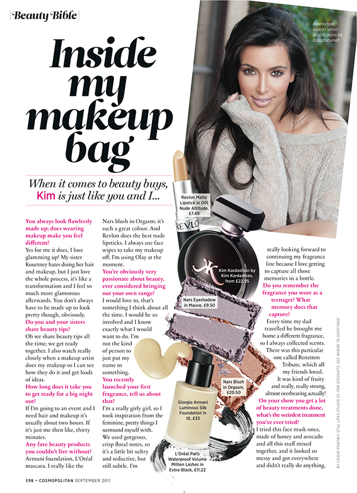
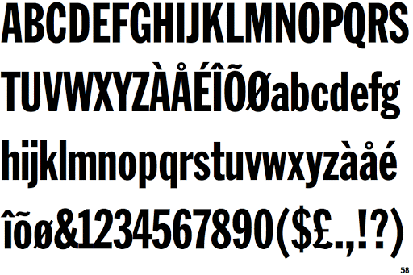
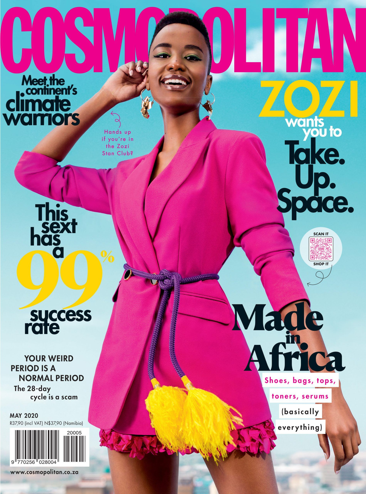
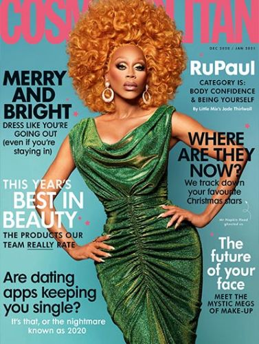

A magazine that I have always been invested in since a teenager, despite its controversy, is Cosmopolitan. Cosmopolitan magazine is a global juggernaut that predominantly features fashion, entertainment, celebrities, beauty and women’s lifestyle. It was first published in the US in 1886 and has been published continuously ever since, conveying their popularity.

The Cosmopolitan reader is a fun, fearless millennial. The global magazine is published in more than 80 countries with a fun, direct and open personality that is expressed on every page. But how does the typography, imagery and composition showcase these characteristics?

The iconic, unique logo is recognised all over the world. The typography and style used was carefully chosen to create a recognisable brand image. The font used for the logo is Franklin Gothic Extra Condensed. This is one of the most popular sans serif to ever be produced, designed by Morris Fuller Benton in 1902 for American Type Founders. The images used are always full of colour and life which illustrates the magazine's personality.

The infamous lettering used by Cosmopolitan has not only become extremely recognisable but also illustrates the fun, bubbly and cheeky personality that the magazine beholds. The array of colours used in the masthead and logo mirrors the racy and open nature that is on the inside. They use many fun, eye catching colours and fonts on the front cover which can often be slightly overwhelming and ‘too much’. This cleverly represents many people’s feelings towards the contents of the magazine itself.

In 2012, Cosmopolitan underwent a front cover redesign. This included less text on the cover and more imagery. They introduced a dynamic quality with partial transparency, angled shapes and layered elements. They also introduced four new typefaces for the redesign Helsinki, Parry, Router and Tiempos. This created a more expensive look and ridded the magazine of its ‘cheap’ and cluttered front page that a lot of people associate with it.

The front page is still quite full and lots of lettering still dominates the area. This is a clear contrast to other high-end magazines such as Vogue. The typography is quite condensed and not very spread out making it squalor. Some of the logo’s letters are often concealed by an image or a celebrity. This conveys just how recognisable the logo really is and how it can be identified even with it being partially hidden. 

Cosmopolitan’s logo often exhibits variating colour. The colours featured are often pink, red, yellow or black. This further emphasises the diversity of the logo and how it can be recognised in any format.

Despite the controversy of the racy, unapologetic magazine Cosmopolitan is still one for the world's leading fashion magazines and the typography of it helps to enhance its popularity.