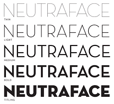

An interesting publication that I am very excited to focus on this week is The New Yorker. The New Yorker is an iconic, gold standard of news and culture in a magazine and comes with a price tag that represents this. The elitist magazine was first published in 1925 and is an American magazine offering reportage, commentary, criticisms, poetry, essays and much more. This publication is the epitome of culture and journalism.

In print, The New Yorker uses two type faces: its signature Irvin type face for headlines and the articles set up using Adobe Caslon. However, the team noticed that Irvin doesn’t work on smartphones, so they introduced a new sans serif font with an Art Deco feel, Neutraface, instead.

Online, the New Yorker articulated a host of changes to their website aimed at modernising the (outdated) site. The predominant change was including a responsive design that works just as perfectly on smartphones as it does on desktops so customers could access the whole content without any design issues.

An interesting, iconic feature of the magazine is of course the front cover. The cover is the epitome of luxurious journalism and art. It features no text or typography only the imagery and art that always tells a specific story without having to be explained. There is never any real imagery or photography it is always carefully chosen and unique artwork that artists have created. The cover is often full of colour and breath-taking work that looks incredibly expensive. The lack of text conveys the amount of space that The New Yorker possesses therefore emphasising its wealth.

The typography within the magazine from the font choice to the page breaks has been deliberately chosen to enhance and draw readership but also to make them read for longer.

 The magazine uses their custom, signature typeface Irvin for headlines. This was designed by Pea Irvin specifically for the magazine in the 1920’s. For text and labels the website uses Adobe Caslon and Neutraface reflecting the custom Caslon and Vogue used for many years in the printed magazine.

The magazine has a proud, visual tradition with an iconic typographic language from the text to the imagery. Irvin adopts all the charm of the original woodcut style and includes ligatures and contextual pairings.

The magazine front cover last week went viral on twitter and made headlines thanks to Adrian Tomine’s brilliant cover illustration depicting a woman on a zoom call holding a full martini glass surrounded by dirty dishes and mess. Many praised the cover for being so relatable in the current crisis.

