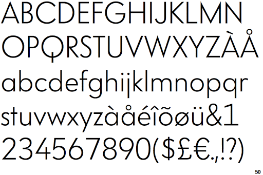

<http://587.claudiastrong.com/vanity-fair-typography-2/ > Being a religious magazine reader, I knew I had to research into the revived, glorious publication Vanity Fair. Vanity Fair is a monthly magazine of popular culture, fashion, celebrities, politics and current affairs. It is published by Conde Nast in the United States but currently publishes five international editions worldwide. The magazine was first published from 1913 to 1936 but was pulled. The imprint was birthed the ‘modern Vanity Fair’ in 1983 and was revived into what we now read. 

 The publication uses various types of typography and imagery to convey the personality and style of the magazine. For example, on the website they primarily use back, red and white lettering. This simplistic, elegant approach reflects the content they produce and the audience they cater and advertise to. The embedded, subtle red that underlines headings and envelopes symbols conveys a modern, more professional look which could symbolise their desired target audience. 

Typography is imagery that means more than the words it spells. It communicates and symbolises a magazines identity visually. It brings all the pages together like brand-identity glue. And in Vanity Fair’s case, typography is central to its identity. Their spreads and covers are often very text heavy and appears as if various typefaces are constantly used. However, Vanity Fair only uses three primary typefaces: VF Didot, TF Didot and VF Sans.

 When creative director Chris Dixon stepped into the role at VF, the typeface took over the VF nameplate in 2013. This was a customised version of the clean and classic Didot typeface but was stretched to give it a brand new, modern look. The classic Didot typeface is used by Vogue, a brand which Vanity Fair share some characteristics with. VF Didot is the most recognisable typeface on the cover of the magazine, used in the nameplate and cover lines using different font sizes, colours, case sizes and italics. 

HTF Didot was created in the 1990s and has been used by VF since the redesign from 2011 to 2013. The Didot typefaces are used in variety throughout the magazine, it works well to set a formal and serious tone in the body text found in the feature wells. Didot embodies and expresses the core foundations and aesthetics of Vanity Fair – classic, elegant, sophisticated and flexible. 

VF Sans is the main san serif typeface used in the magazine that is frequently used in the Front of the Book section and for cut lines. This is a much more playful, informal and gossipy than the rest of the magazine. This font establishes a younger, modern and fresher tone for this particular section. 

Vanity Fair addresses many extremely important, international stories such as the terrible offences of Jeffrey Epstein, the emerge of Caitlin Jenner and many more. Therefore, it is easy to see why they take such pride and effort into their typography, image and overall aesthetic.