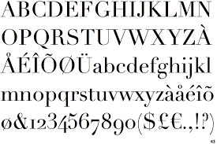
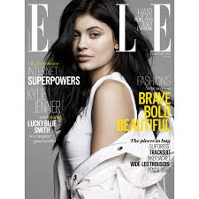
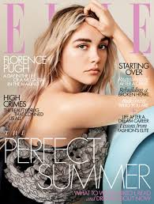

I really enjoyed researching into Elle magazine this week as their style and typography is incredibly interesting. They have an intertwining style of generic and original. Elle is an international lifestyle magazine of French origin that focuses particularly on fashion, health, gossip, celebrities and entertainment. The magazine was founded in 1945 by Helene Gordon-Lazareff and her husband Pierre Lazareff. 

The magazine is an international success and reaches over 69 million readers. Their target audience is generally women between 18 and 49. According to studies, forty percent of the readers are single, and the average household income is $69,973. I considered this while researching the typography. 

Typographical design in magazines is extremely important for attracting readership/ The appropriate choices in colour, images and typography can make or break a magazine’s aesthetics. The font used for Elle Magazine is Didot, serif in nature, which compliments the aesthetics and polish of the whole spread. The Didot font is a commonly used typographical component in magazines. It is featured in other international, prestigious magazines such as Vogue. 

The branding of the magazine often goes hand in hand with the typography. It is also synonymous with the logo. Often the main celebrity or image featured will obscure the masthead. This further emphasises the significance of the craftsman’s branding and typography. Even with a hidden masthead, the strength of the brand prevails. 

On the cover of the iconic magazine, the craftsman name consists of a strong, restricted, san-serif font style. Often on the cover, it features a contrasting typographical relationship to maximise the impact. The masthead and the main cover line are in serif, while the rest of the cover lines are in sans-serif. This relationship creates a visual hierarchy and promotes the serif to be the most important part of the cover. 

Elle is a geometric san in three weights with rounded stroke terminals and circular forms. It conveys a classy, elegant and modern tone which also represents the magazine’s core foundations. The style also illustrates a tone of futuristic ideas. This font is inspired by a single-weight Typositor headline typeface from the early 1970s called Pipeline. 

A conventional tactic used by magazines is to place the most important feature to the left third of the cover. This section is considered the most important and is often large, eye-catching and in a different font from the rest of the text. This lures the reader in and establishes the significance of the article.