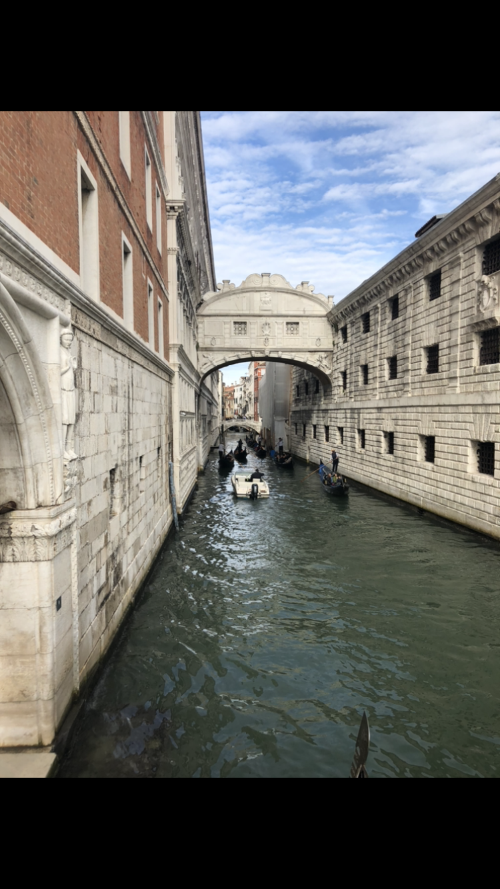
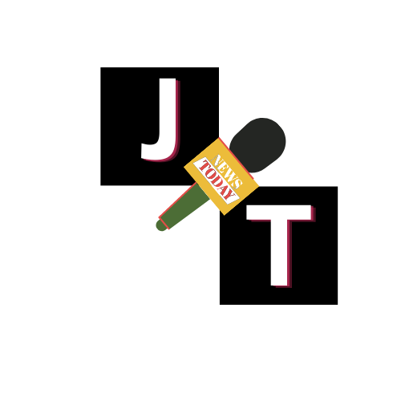
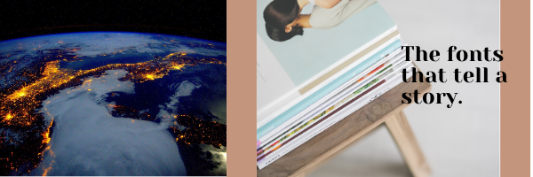

Hi. My name is Lucyanna Paluk. I am currently studying Media, Journalism and Publishing at Oxford Brookes University. My hobbies and interests include going for coffee (a hazlenut latte), spending time with my (3!) cats, going on spontaneous adventures with friends, reading, travelling, walking in cites i've never been to before and, of course, writing. 

I will be analysing fonts within the media and the typographical voice they convey. Are they low contrast? Serifs? Tentative or emphatic? Luxury or squalor? Rigid or casual? I will be searching through these formats to find what voice they are trying to communicate.

Photography, images, composition and colour are all important elements that are often featured within magazine and newspaper’s front covers. They typically communicate to the audience and tell a particular story or divulge a specific emotion. However, a more subtle but incredibly important component is also used to draw in attention and emotions, typography. This simplistic tool is often overlooked but is very effective and important. 

In this blog I will be analysing and exploring a range of various typographical designs used in the media, particularly magazines and newspapers. I will be focusing on what typographical voice is being communicated and how they how achieved this through text but also, why media establishments have used this design.

Journo Type is an abbreviation of the words Journalism and Typography. I chose to focus on journalism as it is something, I am extremely passionate about, and I thought it would be incredibly interesting to find out why certain publications use the font and typographical design they do to almost manipulate readers. My logo uses the font Monospace in size 104. I used this as it is a big and bold font which captures the essence of newspaper headlines, but also the almost handwritten and personal touch of magazines. Monospace is a non-proportional font whose letters and characters each occupy the same amount of horizontal space. I chose this as this gave me the impression of being equal and impartial - attributes which journalism should possess. I chose to arrange the letters diagonal to each other to convey two different sides of an argument and story.

For my banner I wanted to create an international but also personal image. I used an image of the Earth to portray how interconnected journalism makes us and how it is a global concept. For the text I used Anon pro as it’s slightly more tentative and casual, much like the text within magazines.

My goals for this blog are to explore the typographical voice and communications that publications try to illustrate and to understand how subconsciously this encourages us to pick the print up and read it. I wish to become a better analysist of typography and learn how the incorporations of various components make text simplistic but effective.

Thank you in advance for reading, and I hope you enjoy this website as much as I enjoyed writing it!